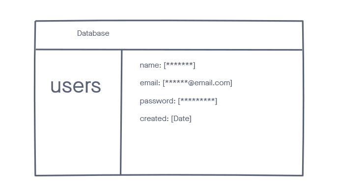
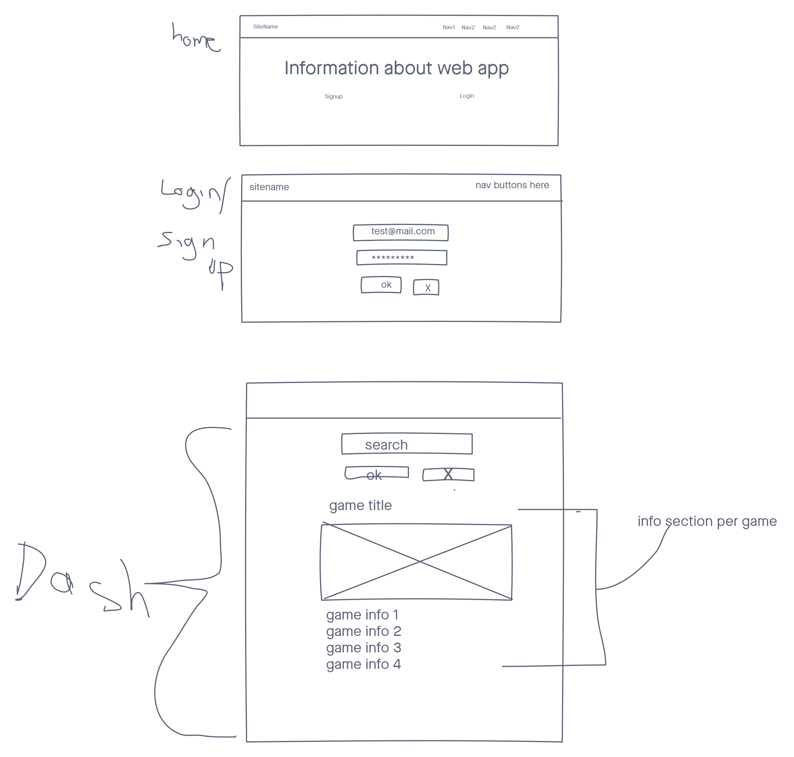
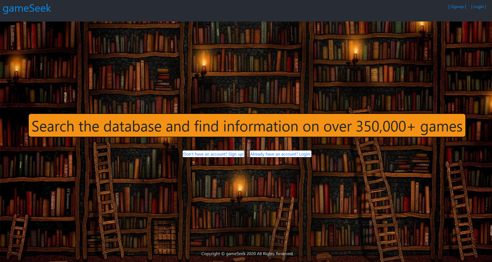
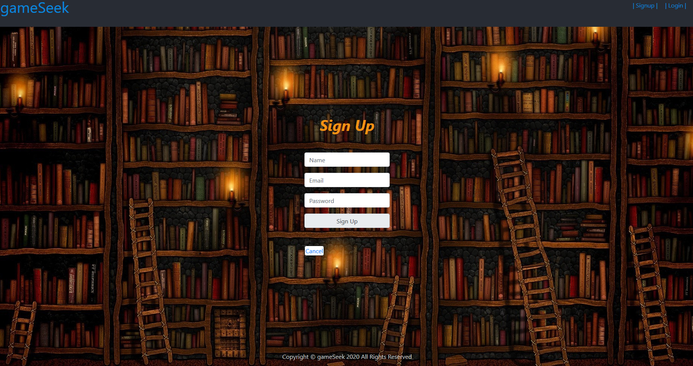
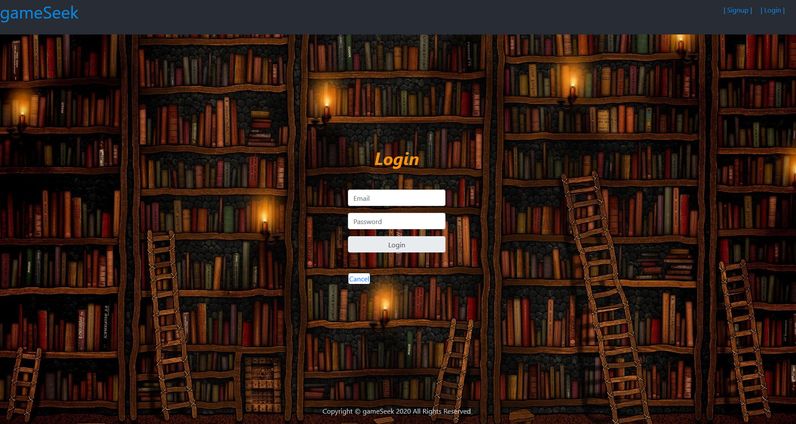
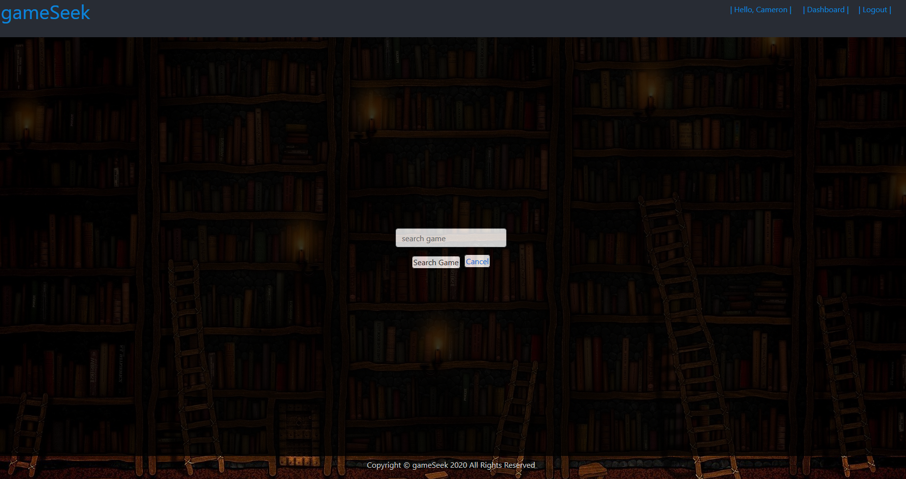
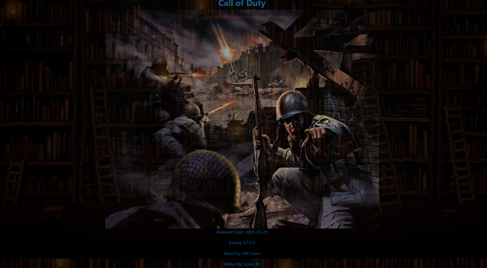

# Getting Started with Create React App

This project was bootstrapped with [Create React App](https://github.com/facebook/create-react-app).

Simple web application that lets users sign up to search a game API database

## Technologies

- HTML5
- CSS3
- JavaScript
- JSX
- React
- Node.js
- Express
- Morgan
- Mongoose
- Dotenv
- MongoDB
- Heroku
- RAWG Video Games Database API

## Screenshots:

ERD:

Wireframes:

Actual Site:

Home:

Signup:

Login:

Dashboard:

DashboardSearch:

## Getting Started

[Click Here](https://trello.com/b/Bc3ImZDN/project-3#) to see the project planning!

[Click Here](https://gameseek.herokuapp.com/) to see the deployed app!

## Unsolved Problems

Need to sanitize the search input and also make it so it can't search if undefined.

## Future Enhancements

Want to add page pagination to the search results instead of loading the first 20 relevant searches.

Make the search results just populate a list of cards with game title and image that's clickable to show the details page instead all at once during search.
